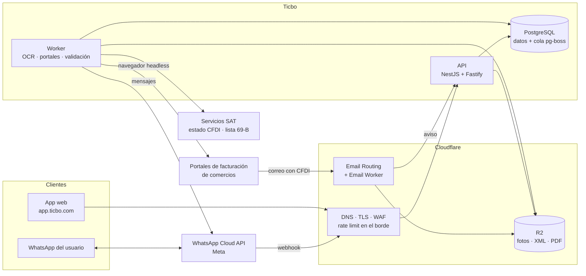
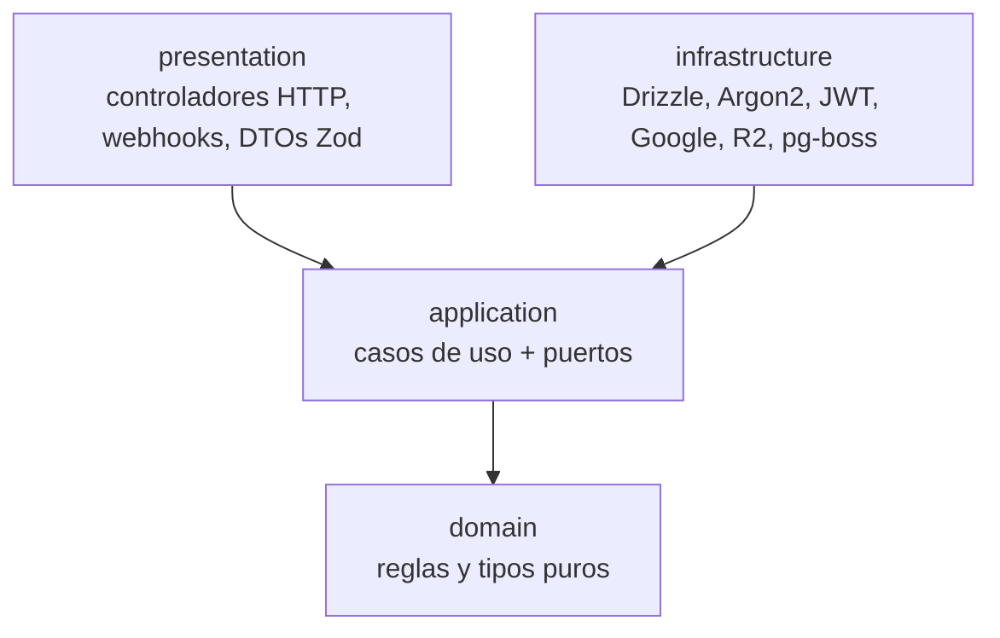
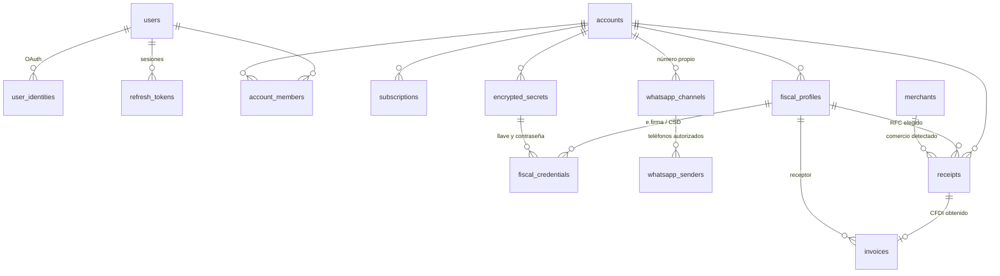
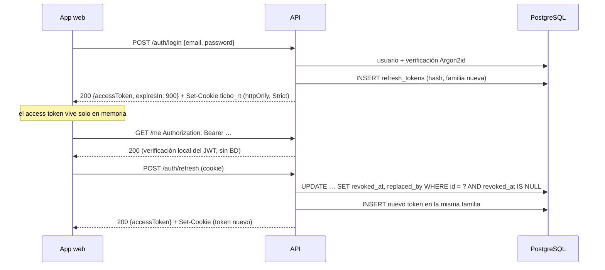
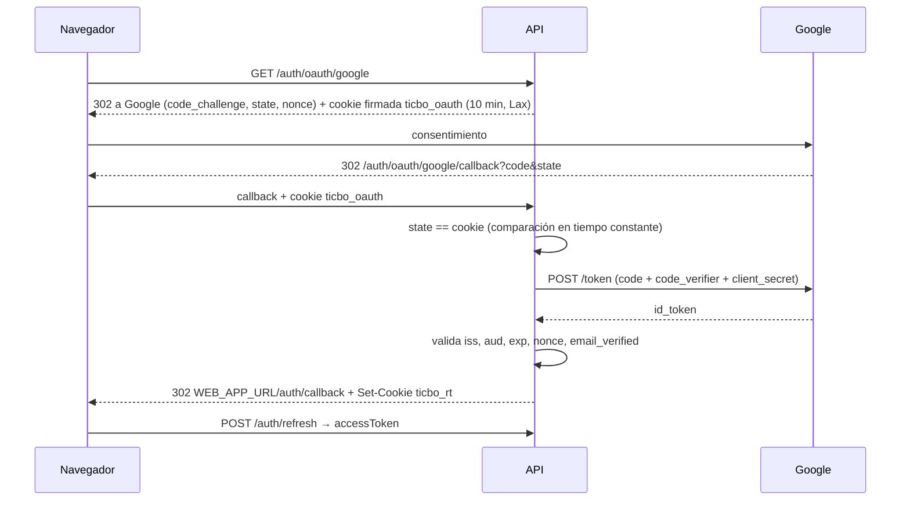
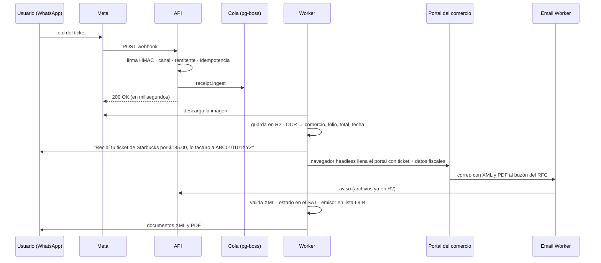
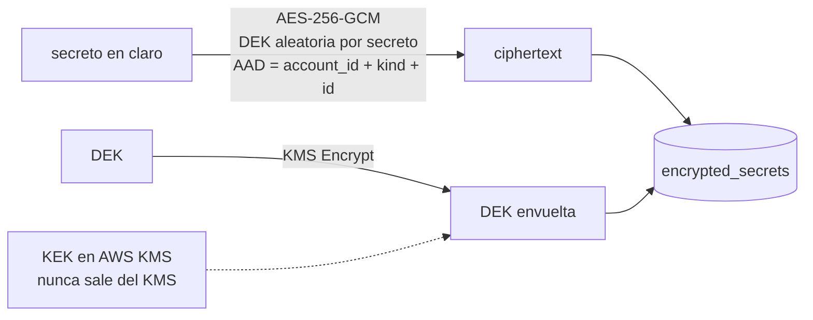

# Ticbo · Diseño del backend

Versión 0.1 · octubre 2026 · Estado: base implementada (identidad, sesiones, esquema multi-tenant); pipeline de tickets diseñado, pendiente de implementar.

Documentos relacionados:
- [Flujo del bot de WhatsApp](../product/flujo-del-bot.md): qué hace el producto, paso a paso.
- [Decisiones de costo](./decisiones-de-costo.md): las tres decisiones de arranque y cómo quedaron.

---

## 1. Contexto

Ticbo factura tickets de compra por WhatsApp. El usuario manda la foto de un ticket (por ejemplo, de Starbucks); Ticbo lee el ticket, identifica al comercio, entra a su portal de facturación con los datos fiscales que el cliente registró y le regresa el XML y el PDF del CFDI por el mismo chat.

Un punto que define la arquitectura: **Ticbo no timbra**. El CFDI lo emite el comercio a través de su PAC; Ticbo actúa por cuenta del receptor y automatiza la solicitud en el portal del comercio. Por eso el trabajo pesado no es el timbrado, sino:

1. Leer tickets heterogéneos (OCR o visión).
2. Mantener un catálogo de portales de facturación y un adaptador de automatización por portal.
3. Recibir el CFDI (por correo o descarga), validarlo ante el SAT y entregarlo.

### Restricciones

| Restricción | Consecuencia en el diseño |
|---|---|
| Costo mínimo desde el día 1 | Un solo Postgres hace de base de datos y de cola; sin Redis, sin balanceador de pago, sin NAT Gateway; almacenamiento en Cloudflare R2 (sin cargos de salida). |
| Multi-tenant B2B con datos fiscales | Un solo esquema con `account_id` y Row-Level Security de PostgreSQL: el aislamiento lo garantiza la base de datos, no solo el código. |
| WhatsApp y procesos de 3 s a varios minutos | El webhook responde `200` de inmediato y todo lo demás ocurre en workers asíncronos. |
| Secretos de clientes (tokens de WhatsApp, e.firma/CSD) | Cifrado de sobre (*envelope encryption*) con llave maestra en KMS; solo los workers descifran. |

### Qué existe hoy en el código

- Proyecto NestJS 12 + Fastify 5 en TypeScript estricto (ESM).
- Esquema completo de PostgreSQL (14 tablas) con RLS en las tablas de datos de cliente y llaves foráneas que no cruzan tenants.
- Módulo `iam`: registro e inicio de sesión con correo y contraseña (Argon2id), Google OAuth (OIDC + PKCE), JWT de acceso, refresh tokens rotativos con detección de reúso, guard global y decoradores.
- Health checks de liveness y readiness, errores en formato RFC 9457, configuración validada al arrancar.
- Docker Compose para desarrollo, imagen de producción multi-stage, 60 pruebas unitarias y 24 e2e contra Postgres real.

---

## 2. Vista general



Dos procesos salen del mismo código y de la misma imagen:

- **API** (`dist/main.js`): HTTP para la app web y los webhooks. Responde rápido, nunca hace trabajo largo.
- **Worker** (pendiente, `dist/worker.js`): consume la cola. Puede escalar, pausarse o correr en otra máquina más grande (el navegador headless necesita ~1 GB) sin tocar la API.

---

## 3. Arquitectura del código

### Capas (hexagonal / Clean Architecture)



La regla de dependencia apunta hacia adentro:

- **domain**: tipos, objetos de valor (`Email`), políticas (`assertAcceptablePassword`, `decideOAuthLink`) y errores. Sin NestJS, sin base de datos, sin HTTP.
- **application**: casos de uso (`RegisterUserUseCase`, `RefreshSessionUseCase`…) y los **puertos** que necesitan (`UserRepository`, `PasswordHasher`, `OAuthProvider`…). Solo conoce interfaces.
- **infrastructure**: adaptadores que implementan los puertos (`DrizzleUserRepository`, `Argon2PasswordHasher`, `GoogleOAuthProvider`).
- **presentation**: traduce HTTP a casos de uso y de vuelta: validación con Zod, cookies, códigos de estado.

Decisiones pragmáticas:

- Los puertos son **clases abstractas**, no interfaces. NestJS puede inyectarlas por tipo (`constructor(private users: UserRepository)`) sin tokens ni `@Inject`, y los adaptadores las implementan con `implements`.
- Los casos de uso llevan `@Injectable()`. Es solo metadata para el contenedor de dependencias; no los acopla a HTTP y se prueban instanciándolos a mano con dobles en memoria (`application/testing/fakes.ts`).
- Los errores esperados extienden `AppError` con un `code` estable y una `category` (`conflict`, `unauthenticated`…). Un único filtro global traduce la categoría a status HTTP; el dominio nunca habla de HTTP.

### Estructura de carpetas

```
src/
  main.ts                     arranque del proceso API
  app.module.ts               composición: módulos, guards y filtro globales
  bootstrap/create-app.ts     Fastify, cookies, helmet, CORS, prefijo /api/v1 (lo usan main y e2e)
  config/                     esquema Zod de variables de entorno → AppConfig tipado
  shared/
    domain/                   AppError, UUIDv7
    application/              Clock
    infrastructure/
      database/               Pool, Drizzle, esquema, TenantDatabase, migraciones, health
      http/                   filtro RFC 9457, ZodValidationPipe, rutas base
      storage/                (pendiente) adaptador S3/R2
      queue/                  (pendiente) adaptador pg-boss
  modules/
    iam/                      identidad y acceso          ✅ implementado
      domain/ application/ infrastructure/ presentation/
    health/                   probes de orquestación      ✅ implementado
    fiscal/                   perfiles fiscales (RFC receptor), e.firma/CSD
    vault/                    cifrado de sobre de secretos
    messaging/                canal de WhatsApp: webhooks, envío de mensajes
    receipts/                 ingesta del ticket, OCR, máquina de estados
    invoicing/                catálogo de comercios, adaptadores de portal, CFDI
    billing/                  planes, suscripciones, límites de uso
drizzle/                      migraciones SQL generadas y manuales
test/                         pruebas e2e contra PostgreSQL real
docker/                       script de inicialización de Postgres
docs/                         este documento y la documentación de producto
```

### Contextos (módulos)

| Módulo | Responsabilidad | Tablas |
|---|---|---|
| `iam` | Usuarios, inicio de sesión, sesiones, cuentas (tenants) y membresías | `users`, `user_identities`, `refresh_tokens`, `accounts`, `account_members` |
| `fiscal` | Datos del receptor que piden los portales; e.firma/CSD cuando aplique | `fiscal_profiles`, `fiscal_credentials` |
| `vault` | Sellar y abrir secretos de clientes; rotación de llaves | `encrypted_secrets` |
| `messaging` | Conectar números de WhatsApp, validar webhooks, enviar respuestas y documentos | `whatsapp_channels`, `whatsapp_senders` |
| `receipts` | Ticket recibido → datos extraídos → comercio y RFC elegidos | `receipts` |
| `invoicing` | Catálogo de portales, automatización, recepción y validación del CFDI | `merchants`, `invoices` |
| `billing` | Plan, ciclo, estado de pago, límites por plan | `subscriptions` |

Un módulo usa a otro solo a través de su capa de aplicación (casos de uso o puertos exportados), nunca leyendo sus tablas.

---

## 4. Modelo de datos (PostgreSQL)

### Plano de control y plano de datos

El tenant es la **cuenta** (`accounts`). Al registrarse, cada usuario recibe una cuenta personal de la que es dueño; además puede pertenecer a cuentas de organización (una PyME, un despacho contable) con un rol.

- **Plano de control** (sin RLS): tablas que se consultan *antes* de saber quién es el tenant, como el login, la renovación de sesión, el webhook de WhatsApp (solo trae el `phone_number_id`) o el webhook del proveedor de pagos. Solo contienen identidad, ruteo y facturación de Ticbo.
- **Plano de datos** (con RLS): todo dato fiscal o de negocio del cliente. Cada fila lleva `account_id` y PostgreSQL filtra por tenant.



| Tabla | Plano | Propósito |
|---|---|---|
| `users` | control | Persona que inicia sesión. Correo único en minúsculas (CHECK). `password_hash` nulo si solo usa OAuth. |
| `user_identities` | control | Vínculo con Google/Facebook por `(provider, subject)`; el `sub` del proveedor nunca cambia, el correo sí. |
| `refresh_tokens` | control | Hash SHA-256 de cada refresh token, familia, expiración, rotación (`replaced_by_id`) y revocación. |
| `accounts` | control | El tenant: `personal` u `organization`. |
| `account_members` | control | Usuario ↔ cuenta con rol `owner`, `admin`, `member` o `viewer`. |
| `subscriptions` | control | Plan (`pro`, `negocio`, `despacho`), ciclo, estado e ids del proveedor de pagos. Índice único parcial: una sola suscripción no cancelada por cuenta. Los límites de cada plan viven en código, junto al catálogo de planes. |
| `whatsapp_channels` | control | Número de WhatsApp Business conectado: `phone_number_id` (llave de ruteo del webhook), WABA y referencias a sus secretos. `account_id` nulo = número compartido de Ticbo. |
| `whatsapp_senders` | control | Teléfonos autorizados a mandar tickets a un canal, con su usuario y RFC por defecto. |
| `merchants` | global | Catálogo compartido: comercio, RFC emisor, URL del portal, adaptador, campos que pide el portal y días de vigencia para facturar. |
| `encrypted_secrets` | datos | Secretos cifrados (ver §7). |
| `fiscal_profiles` | datos | RFC, razón social, régimen fiscal, código postal, uso de CFDI por defecto y buzón de Ticbo al que llegan los CFDI. CHECK de formato de RFC y CP. |
| `fiscal_credentials` | datos | e.firma o CSD: certificado público y referencias a la llave privada y su contraseña en el vault. |
| `receipts` | datos | El ticket: origen, id del mensaje (idempotencia), foto en R2, datos extraídos, estado del pipeline, intentos y último error. |
| `invoices` | datos | El CFDI recibido: UUID fiscal, emisor, receptor, totales, llaves de XML/PDF en R2, estado ante el SAT y estado del emisor en la lista 69-B. |

### Aislamiento entre tenants

Elegimos un esquema compartido con `account_id` y Row-Level Security, en lugar de un esquema o una base de datos por cliente:

- **Costo**: una sola base de datos pequeña sirve a todos los clientes; esquemas por tenant multiplican catálogos, migraciones y conexiones.
- **Operación**: una migración, un pool, un respaldo.
- **Seguridad en profundidad**: aunque un desarrollador olvide un `WHERE account_id = …`, PostgreSQL no devuelve ni modifica filas de otro tenant.

Cómo funciona (migración `drizzle/0001_tenant_isolation.sql`):

1. La API se conecta como `ticbo_app`, un rol que **no es dueño** de las tablas, así que las políticas se le aplican siempre. Las migraciones corren con el rol dueño.
2. El código de negocio entra a datos de cliente solo a través de `TenantDatabase.run(accountId, tx => …)`, que abre una transacción y ejecuta `set_config('app.account_id', accountId, true)`. El `true` limita el valor a esa transacción: no se filtra a otra petición y es compatible con PgBouncer en modo transacción.
3. Cada tabla de datos tiene la política `account_id = app_current_account_id()` para lectura (`USING`) y escritura (`WITH CHECK`).
4. **Falla cerrado**: sin `app.account_id` no se ve ninguna fila.
5. Las llaves foráneas entre tablas de cliente son **compuestas con `account_id`** (por ejemplo, `receipts(fiscal_profile_id, account_id) → fiscal_profiles(id, account_id)`). Es necesario porque PostgreSQL valida llaves foráneas sin aplicar RLS: con una llave simple, un tenant que conociera un id ajeno podría referenciarlo.

Las pruebas e2e de `test/tenant-isolation.e2e-spec.ts` lo verifican con códigos SQLSTATE: lectura aislada, falla cerrada, escritura rechazada (42501), referencia cruzada rechazada (23503) y formato de RFC (23514).

### Convenciones

- **Ids UUIDv7** generados por la aplicación: ordenados por tiempo (inserciones al final del índice B-tree) y conocidos antes de escribir. El `DEFAULT gen_random_uuid()` existe solo para inserciones manuales.
- Fechas `timestamptz`; dinero `numeric(14,2)`, nunca flotantes.
- Enums de PostgreSQL para conjuntos estables (estados, roles). Agregar un valor es barato (`ALTER TYPE … ADD VALUE`).
- Índices pensados para las consultas del tablero: `(account_id, created_at DESC)` en tickets y `(account_id, issued_at DESC)` en facturas.
- Cuando `receipts` e `invoices` pasen de decenas de millones de filas, se particionan por mes; las llaves ya incluyen `account_id` para facilitarlo.

### Migraciones

- El esquema vive en `src/shared/infrastructure/database/schema/*.ts` (Drizzle).
- `npm run db:generate` crea el SQL en `drizzle/`. Lo que Drizzle no expresa (RLS, permisos, funciones) va en migraciones manuales: `npx drizzle-kit generate --custom --name <nombre>`.
- `npm run db:migrate` (dev) o `node dist/shared/infrastructure/database/migrate.js` (contenedor) aplica lo pendiente con `DATABASE_MIGRATION_URL`. En producción corre como paso de *release*, antes de desplegar la nueva versión.

---

## 5. Autenticación y autorización

### Resumen

| Mecanismo | Implementación |
|---|---|
| Correo y contraseña | Argon2id (19 MiB, 2 pasadas, 1 hilo; sal aleatoria de 16 bytes por hash) |
| Federado | Google con OpenID Connect, flujo *authorization code* + PKCE S256 + `state` + `nonce` |
| Token de acceso | JWT HS256 de 15 min con `sub`, `sid`, `acc` (cuenta activa) y `role`; se verifica sin consultar la base de datos |
| Sesión | Refresh token opaco de 256 bits, guardado como hash, en cookie `httpOnly`, rotado en cada uso, con detección de reúso |
| Rutas protegidas | Guard global `JwtAuthGuard`: toda ruta exige `Bearer` salvo las marcadas con `@Public()` |

### Endpoints

| Método y ruta | Acceso | Descripción |
|---|---|---|
| `POST /api/v1/auth/register` | público | Crea usuario y cuenta personal; responde el token de acceso y fija la cookie de sesión. `409 email_already_registered` si el correo existe. |
| `POST /api/v1/auth/login` | público | Correo y contraseña. `401 invalid_credentials` con la misma respuesta y el mismo trabajo de hash exista o no el correo. |
| `POST /api/v1/auth/refresh` | cookie | Rota el refresh token y entrega un token de acceso nuevo. |
| `POST /api/v1/auth/logout` | cookie | Revoca la familia de la sesión y borra la cookie. `204`. |
| `GET /api/v1/auth/oauth/:provider` | público | Redirige al proveedor (`google`). `404 oauth_provider_not_enabled` si no está configurado. |
| `GET /api/v1/auth/oauth/:provider/callback` | público | Valida `state`, intercambia el código, inicia sesión y redirige a `WEB_APP_URL/auth/callback` (o a `/login?error=<code>`). |
| `GET /api/v1/me` | Bearer | Usuario, cuenta activa y todas sus cuentas. |
| `GET /api/v1/health` | público | Readiness: `200` o `503` si PostgreSQL no responde. |
| `GET /api/v1/health/live` | público | Liveness: el proceso responde. |

Los errores siguen RFC 9457 (`application/problem+json`) con un `code` estable para el frontend y el `requestId` para soporte:

```json
{
  "type": "about:blank",
  "title": "Bad Request",
  "status": 400,
  "code": "validation_failed",
  "detail": "The request is invalid.",
  "errors": [{ "path": "password", "message": "Passwords must be between 12 and 128 characters long.", "code": "custom" }],
  "instance": "/api/v1/auth/register",
  "requestId": "6c28899b-ceba-4c89-b315-c18ca4179e72"
}
```

### Tokens y su almacenamiento en el cliente



- **Access token en memoria, nunca en `localStorage`**: un XSS no puede robar una sesión duradera.
- **Refresh token en cookie** `httpOnly` (JavaScript no la lee), `SameSite=Strict` (no viaja en peticiones de otro sitio, lo que también elimina CSRF sobre `/auth/refresh`) y `Path=/api/v1/auth` (no viaja al resto de la API). `Secure` siempre que la API esté en https. `app.ticbo.com` y `api.ticbo.com` son el mismo sitio, así que la cookie funciona entre ambos.
- **Rotación con detección de reúso**: cada refresh token sirve una vez. Si llega uno ya rotado, se asume robado y se revoca la familia entera: el atacante y el usuario legítimo deben volver a iniciar sesión. Hay una ventana de gracia configurable (10 s) para dos pestañas que renuevan al mismo tiempo: la que pierde recibe `401` sin cerrar la sesión de la otra.
- La rotación es un *compare-and-set* en SQL: de dos rotaciones concurrentes del mismo token, solo una gana.
- Expiración deslizante de 30 días por inactividad (`REFRESH_TOKEN_TTL_DAYS`).
- El token de acceso no se puede revocar antes de que expire (15 min); es el precio de no consultar la base de datos en cada petición. Cambios de rol o de cuenta se reflejan en la siguiente renovación.
- Las respuestas con tokens llevan `Cache-Control: no-store`.

### Google OAuth sin Passport



No usamos Passport.js:

- Sus estrategias OAuth asumen Express y sesiones de servidor (para guardar `state` y el verificador PKCE). Sobre Fastify requieren adaptaciones y un almacén de sesiones que no queremos operar.
- El flujo sin estado (`state`, `code_verifier` y `nonce` en una cookie firmada de 10 minutos) son unas 150 líneas, auditables y probadas.
- La abstracción es el patrón *strategy*: el puerto `OAuthProvider` y un `OAuthProviderRegistry`. Agregar Facebook o Microsoft es escribir un adaptador y registrarlo; las rutas y la lógica de vinculación no cambian.

Tampoco Auth0, Clerk o Supabase Auth en esta etapa: cobran por usuario activo mensual, agregan un proveedor crítico más y la parte difícil (cuentas, tenants, roles) seguiría siendo nuestra. El puerto permite cambiar de opinión después.

El `id_token` llega directo del endpoint de tokens de Google por TLS, así que, según OpenID Connect Core §3.1.3.7, no es necesario verificar su firma. Sí se validan todas las *claims* que lo atan a este inicio de sesión: emisor, audiencia, expiración y `nonce`.

### Reglas de seguridad implementadas

- **Contraseñas**: 12 a 128 caracteres contados como puntos de código, sin reglas de composición (NIST SP 800-63B); normalización NFKC antes de hashear. Si cambian los parámetros de Argon2, el hash se actualiza en el siguiente login.
- **Sin enumeración de cuentas en el login**: correo inexistente, usuario solo-OAuth y contraseña incorrecta dan la misma respuesta tras el mismo trabajo de Argon2 (contra un hash señuelo). El registro sí responde `409` si el correo existe, por usabilidad, y lo compensa con un límite de peticiones.
- **Robo de cuenta por pre-registro**: si alguien registra el correo de otra persona sin verificarlo y luego la dueña real entra con Google, se vincula la identidad, **se borra la contraseña del intruso y se revocan sus sesiones** (`decideOAuthLink`).
- **Límites de peticiones** por IP: 10/min en registro y login, 20/min en OAuth, 30/min en el resto de `/auth`, 120/min global. Los health checks no tienen límite.
- **CORS** solo para los orígenes de `CORS_ORIGINS`, con credenciales.
- **Cabeceras** de `@fastify/helmet` (HSTS, `nosniff`, sin `x-powered-by`…).
- **Logs** en JSON (pino) con id de petición; se registra la ruta sin query string, porque ahí viajan los códigos OAuth.
- **Configuración** validada con Zod al arrancar; un error lista todas las variables inválidas sin mostrar sus valores. No hay credenciales en el código: `npm run setup:env` genera secretos aleatorios para desarrollo.

### Autorización y tenants

- El token lleva la cuenta activa (`acc`) y el rol en ella (`role`). Al iniciar sesión, la cuenta activa es la personal.
- Las rutas de datos de cliente usarán `principal.accountId` para abrir `TenantDatabase.run(...)`: el tenant sale del token firmado, nunca del body ni de la URL.
- Roles: `owner` (todo, incluida la facturación de Ticbo), `admin` (usuarios, RFCs, números de WhatsApp), `member` (manda tickets, ve los suyos), `viewer` (contador o auditor de solo lectura).

### Pendientes de identidad

| Pendiente | Motivo |
|---|---|
| Verificación de correo y recuperación de contraseña | Requiere correo transaccional (Amazon SES o Resend). Hasta entonces, exigir correo verificado antes de cargar e.firma/CSD. |
| `POST /auth/switch-account` y `RolesGuard` | Cambiar de cuenta activa y restringir rutas por rol. |
| MFA (TOTP) para `owner` y `admin` | Esas cuentas controlan datos fiscales de terceros. |
| Bloqueo progresivo por cuenta | El límite por IP no frena ataques distribuidos contra un solo correo. |
| Almacén compartido para el rate limit | Hoy los contadores viven en memoria; con más de una instancia pasan a Postgres o Redis. |
| Bitácora de auditoría (`audit_events`) | Inicios de sesión, cambios de rol y cada acceso a secretos del vault. |
| Rotación de `JWT_ACCESS_SECRET` | Usar `kid` y aceptar dos secretos durante la transición. |

---

## 6. Pipeline asíncrono: de la foto al CFDI

> Estado: diseñado; el esquema (`whatsapp_channels`, `whatsapp_senders`, `receipts`, `merchants`, `invoices`) ya existe, los módulos `messaging`, `receipts` e `invoicing` están por implementar.

Ver el flujo de producto completo en [flujo-del-bot.md](../product/flujo-del-bot.md). Aquí está lo técnico.

### Conexión de WhatsApp

Cada cliente conecta **su propio número** de WhatsApp Business: captura en la app el `phone_number_id`, el WABA id, el token de acceso y el *app secret* de su app de Meta. Ticbo los guarda cifrados (§7) y le muestra la URL del webhook y un *verify token* para registrar en Meta.

- Webhook por canal: `GET/POST /api/v1/webhooks/whatsapp/:channelId`. El `GET` responde el *challenge* de verificación de Meta comparando el *verify token* contra su hash.
- Cada `POST` se valida con `X-Hub-Signature-256` (HMAC-SHA256 del cuerpo crudo con el *app secret* del canal). Sin firma válida, `401`. Requiere habilitar `rawBody` en Fastify para esa ruta.
- El canal se resuelve por `phone_number_id` en `whatsapp_channels` (plano de control) y el remitente por `wa_id` en `whatsapp_senders`. Un teléfono no autorizado recibe un mensaje de "número no registrado" y no genera trabajo.
- A futuro, Ticbo puede registrarse como *Tech Provider* de Meta y usar *Embedded Signup*: el cliente conecta su número con unos clics y un solo webhook atiende a todos los canales, ruteado por `phone_number_id`. El modelo de datos ya lo soporta.

### Etapas



| Trabajo | Qué hace | Reintentos |
|---|---|---|
| `receipt.ingest` | Descarga la imagen de Meta, la guarda en R2, crea `receipts` (idempotente por `source_message_id`) | 5, backoff exponencial |
| `receipt.extract` | OCR o visión → comercio, RFC emisor, folio, fecha, total, sucursal; confianza por campo | 3 |
| `receipt.match` | Busca el comercio en `merchants`; elige RFC receptor (remitente → perfil por defecto; si hay varios, pregunta en el chat) | — |
| `invoice.request` | Ejecuta el adaptador del portal (`merchants.adapter_key`) con los datos del ticket y del perfil fiscal | 3, luego `needs_review` |
| `invoice.collect` | Asocia el correo entrante (o la descarga del portal) con el ticket; guarda XML/PDF en R2 | espera hasta 24 h |
| `invoice.validate` | Valida el XML (UUID, receptor correcto, totales), consulta el estado en el SAT y la lista 69-B del emisor | 5 |
| `notify.send` | Envía mensajes y documentos por WhatsApp | 5 |

Estados de `receipts.status`: `received → extracting → requesting_invoice → awaiting_cfdi → invoiced`, con salidas a `needs_review` (requiere intervención humana) o `failed`.

### Por qué una cola en Postgres y no BullMQ con Redis

La nota de costos original proponía BullMQ con Redis. Para el arranque usamos **pg-boss sobre el mismo PostgreSQL**:

- **Una pieza menos que pagar y operar**: Redis administrado cuesta una instancia más, y BullMQ en Redis serverless (Upstash) cobra por comando y consume muchos.
- **Consistencia**: crear el ticket y encolar su trabajo ocurre en la misma transacción. Con Redis, un fallo entre ambos pasos deja tickets sin procesar o trabajos huérfanos.
- **Capacidad suficiente**: `SELECT … FOR UPDATE SKIP LOCKED` maneja cientos de trabajos por segundo; el plan Despacho, el más grande, son 2,000 facturas al mes.
- pg-boss trae reintentos con backoff, expiración, cola de trabajos muertos, prioridades y trabajos programados (limpieza de tokens, reintentos de validación ante el SAT).

La cola queda detrás de un puerto (`JobQueue`): pasar a BullMQ, SQS o Cloudflare Queues es cambiar un adaptador. **Criterios para cambiar**: más de ~50 trabajos por segundo sostenidos, o que la cola compita con las consultas de la app por CPU de la base de datos.

### Automatización de portales

- Un **adaptador por portal** (`invoicing/infrastructure/portals/<comercio>.adapter.ts`) implementa el puerto `MerchantPortal`: recibe los datos del ticket y del perfil fiscal y regresa "solicitado", "ya facturado", "fuera de plazo" o "requiere revisión".
- Corre con **Playwright** en un worker separado, porque un Chromium usa unos 300–500 MB. Con una concurrencia de 1 a 2 por instancia pequeña basta al inicio. Alternativa de pago por uso: Cloudflare Browser Rendering.
- El correo que se captura en el portal es el **buzón del perfil fiscal** (`fiscal_profiles.invoice_email`), así el CFDI llega a Ticbo por Cloudflare Email Routing, que es gratuito, y un Email Worker lo deja en R2.
- Los portales cambian sin aviso: cada adaptador tiene una prueba de humo diaria y el comercio pasa a `degraded` si falla, para avisar al usuario en vez de reintentar a ciegas.
- Los CAPTCHA y los casos raros pasan a `needs_review` (cola humana en el panel), nunca a reintentos infinitos.
- `merchants.invoice_window_days` evita intentar tickets vencidos (muchos portales solo facturan dentro del mes de compra).

### Reglas de WhatsApp que afectan el costo

- Dentro de las 24 h posteriores al último mensaje del usuario se responde con mensajes libres. Fuera de esa ventana solo se pueden enviar plantillas aprobadas, con costo por mensaje.
- La mayoría de los CFDI llegan en minutos; si uno tarda más de 24 h, la entrega usa una plantilla de "tu factura está lista".

### OCR

El puerto `ReceiptReader` tiene dos candidatos de pago por uso, sin infraestructura propia: Amazon Textract AnalyzeExpense (especializado en tickets) o un modelo de visión multimodal que devuelva directamente JSON estructurado. Se decide con una prueba sobre 200 tickets reales mexicanos (gasolina, restaurantes, conveniencia), midiendo precisión por campo y costo por ticket.

---

## 7. Secretos de clientes y cifrado

> Estado: diseñado; la tabla `encrypted_secrets` y sus llaves foráneas existen, el módulo `vault` está por implementar.

### Qué se guarda y por qué

| Secreto | Para qué | Cuándo se pide |
|---|---|---|
| Token de acceso de WhatsApp y *app secret* | Enviar mensajes y validar webhooks del número del cliente | Al conectar el canal |
| e.firma (FIEL): `.key` y contraseña | Descarga masiva de CFDI recibidos desde el SAT (plan Despacho) | Solo si se activa esa función |
| CSD: `.key` y contraseña | Solo si algún día Ticbo emite CFDI a nombre del cliente | Hoy no se necesita |

El flujo principal (solicitar la factura en el portal del comercio) **no requiere e.firma ni CSD**: los portales solo piden RFC, razón social, régimen, código postal, uso de CFDI y correo. Pedir una llave privada que no se usa solo aumenta el riesgo, así que se pide únicamente al activar la función que la necesita.

### Cifrado de sobre



- Cada secreto se cifra con su propia llave de datos (DEK) usando AES-256-GCM. La DEK se cifra ("envuelve") con una llave maestra (KEK) que vive en AWS KMS y nunca sale de ahí. En la tabla solo quedan el texto cifrado (IV + tag + datos), la DEK envuelta y el id de la KEK.
- **AAD** (datos autenticados) = `account_id`, tipo e id del secreto. Si alguien copia el texto cifrado a otra fila u otra cuenta, el descifrado falla.
- **Solo los workers descifran**, y solo justo antes de usar el secreto. La API escribe secretos pero nunca los devuelve: la app muestra "conectado" y la fecha, no el valor.
- **Rotación**: rotar la KEK significa volver a envolver las DEK (`key_id` indica cuáles faltan), sin tocar los datos.
- **Costo**: una llave de KMS cuesta del orden de 1 USD al mes y las operaciones se cobran por cada 10,000. Las DEK descifradas se cachean unos minutos en memoria del worker para no llamar a KMS en cada mensaje.
- En desarrollo, el adaptador local usa una KEK de la variable `VAULT_LOCAL_KEK`; en producción esa variable no existe y el arranque falla si falta KMS.

Los secretos de la propia plataforma (`JWT_ACCESS_SECRET`, `COOKIE_SECRET`, contraseñas de la base de datos) viven en el gestor de secretos del proveedor de despliegue, nunca en archivos del repositorio.

---

## 8. Infraestructura y costos

### Fase 0: lanzamiento (0 a ~100 cuentas)

| Pieza | Elección | Por qué |
|---|---|---|
| Borde | Cloudflare (plan gratuito): DNS, TLS, WAF, reglas de rate limit | Protege y termina TLS sin costo; oculta el origen |
| API + worker | 1 contenedor de 0.5 vCPU / 512 MB para la API y otro de ~1 GB para el worker, en un PaaS de contenedores (Fly.io, Railway, Render) o una VM ARM pequeña | Sin balanceador de pago: el ingreso lo da la plataforma o Cloudflare Tunnel |
| Base de datos | PostgreSQL administrado pequeño (Neon, Supabase o RDS `db.t4g.micro`) con *pooler* | Una base para datos y cola |
| Archivos | Cloudflare R2 | Compatible con S3 y **sin cargos de salida**: descargar XML/PDF (lo más frecuente) no cuesta transferencia |
| Correo entrante | Cloudflare Email Routing + Email Worker | Gratuito; recibe los CFDI que mandan los portales |
| Secretos de clientes | AWS KMS (una llave) | Centavos al mes a este volumen |
| Logs | Salida JSON del contenedor hacia los logs de la plataforma | Sin agente ni servicio extra al inicio |

Trampas de costo que evitamos a propósito: AWS ALB (cobro fijo por hora más capacidad), NAT Gateway (cobro fijo más cobro por GB) y Redis administrado siempre encendido. Juntos cuestan más que todo lo demás en esta etapa.

### Dimensionamiento

- **Argon2id usa 19 MiB por hash en curso.** Con 512 MB y el límite de 10 inicios de sesión por minuto por IP, la memoria alcanza de sobra. Si se baja la memoria del contenedor, no hay que bajar el costo de Argon2: hay que limitar los hashes concurrentes.
- **Pool de conexiones**: 10 por instancia (`DATABASE_POOL_MAX`). En producción la app se conecta al *pooler* del proveedor (PgBouncer en modo transacción). Es compatible porque el contexto de tenant (`set_config(..., true)`) vive dentro de la transacción y `node-postgres` usa sentencias preparadas sin nombre.
- **Timeouts** en la conexión: `statement_timeout` de 10 s e `idle_in_transaction_session_timeout` de 15 s, para que una consulta o transacción olvidada no bloquee una base de datos pequeña.
- **Imagen**: Node 24 Alpine, solo dependencias de producción, usuario sin privilegios y código que ese usuario no puede modificar.

### Caché en el borde

- Las respuestas de la API son privadas (`no-store`) y no se cachean.
- Los archivos en R2 no son públicos: la API entrega URLs firmadas de vida corta (5 min) para cada XML/PDF/foto.
- La landing y la app web se sirven como estáticos desde Cloudflare Pages o Vercel.

### Cuándo escalar

| Señal | Acción |
|---|---|
| CPU de la API arriba de 60 % sostenido | Segunda instancia de la API; mover el rate limit a un almacén compartido |
| Cola con retraso de más de 1 minuto | Más instancias de worker; separar la cola de portales (lenta) de la de mensajes (rápida) |
| Base de datos arriba de 70 % de CPU o conexiones | Subir de tamaño; réplica de lectura para reportes |
| Más de ~50 trabajos por segundo | Mover la cola a SQS o Cloudflare Queues (cambio de adaptador) |

### Observabilidad

- Hoy: logs JSON con `reqId`, `requestId` en cada error devuelto, readiness y liveness.
- Siguiente: OpenTelemetry (trazas HTTP, SQL y de trabajos), Sentry para excepciones y métricas de negocio: tickets por estado, tiempo de foto a CFDI y tasa de éxito por portal.

---

## 9. Desarrollo y operación

```bash
npm install
npm run setup:env        # .env con secretos locales aleatorios
npm run db:up            # PostgreSQL 18 en Docker
npm run db:migrate
npm run start:dev        # http://localhost:4000/api/v1/health
npm test                 # unitarias
npm run test:e2e         # e2e contra la base ticbo_test
```

**Release a producción**:

1. Construir la imagen (`docker build --build-arg APP_VERSION=<sha>`).
2. Ejecutar `node dist/shared/infrastructure/database/migrate.js` con `DATABASE_MIGRATION_URL`.
3. Desplegar. El orquestador espera a que `/api/v1/health` responda `200` antes de mandar tráfico.

Las migraciones deben ser compatibles hacia atrás (expandir y luego contraer), para que la versión anterior siga funcionando mientras se despliega la nueva.

En una base administrada, el rol `ticbo_app` se crea una vez con contraseña (`CREATE ROLE ticbo_app LOGIN PASSWORD '…'`) antes de la primera migración. La migración le otorga permisos y nunca lo hace dueño de las tablas.

---

## 10. Registro de decisiones

| # | Decisión | Alternativas descartadas | Motivo |
|---|---|---|---|
| 1 | NestJS 12 + Fastify 5, ESM | Express; Fastify solo | Estructura modular e inyección de dependencias para un equipo que crecerá; Fastify consume menos CPU y memoria que Express |
| 2 | Drizzle ORM + `pg` | Prisma, TypeORM | Sin motor binario ni proceso extra; SQL explícito; tipos inferidos del esquema; migraciones SQL revisables |
| 3 | Zod para entrada y configuración | class-validator | Un solo lenguaje de validación para HTTP y variables de entorno; tipos inferidos |
| 4 | Esquema compartido + RLS | Esquema o base por tenant | Costo y operación; aislamiento garantizado por la base de datos |
| 5 | pg-boss en Postgres | BullMQ + Redis | Una pieza menos; encolar dentro de la misma transacción que el negocio |
| 6 | Cloudflare R2 | S3 estándar | Sin cargos de salida; API S3 compatible |
| 7 | OAuth propio sobre el puerto `OAuthProvider` | Passport.js, Auth0/Supabase Auth | Sin sesiones de servidor en Fastify; sin costo por usuario; vinculación de cuentas bajo nuestro control |
| 8 | JWT de acceso HS256 + refresh opaco rotativo | Sesiones en servidor; JWT de larga vida | Verificación sin base de datos en cada petición, con revocación real en el refresh |
| 9 | Argon2id | bcrypt | Resistente a GPU por costo de memoria; recomendado por OWASP |
| 10 | UUIDv7 generados por la app | `bigserial`, UUIDv4 | Ordenados por tiempo, sin coordinación, no enumerables |

### Preguntas abiertas

1. **Número propio o número compartido.** El producto pide que cada cliente conecte sus credenciales de WhatsApp, pero el plan Pro dice "1 número de WhatsApp vinculado", que para un freelancer suena a vincular su teléfono personal a un número de Ticbo. ¿Pro usa el número compartido de Ticbo y Negocio/Despacho su número propio? El esquema soporta ambos.
2. **Proveedor de OCR**: decidir con la prueba de 200 tickets (§6).
3. **Proveedor de pagos**: Stripe, o Mercado Pago/Conekta si se quiere cobrar con OXXO y SPEI en MXN.
4. **e.firma para descarga masiva** (plan Despacho): confirmar si la función entra en el primer lanzamiento, porque define si el vault de llaves fiscales se usa desde el día 1.
5. **Aviso de privacidad (LFPDPPP)**: se guardan datos fiscales y fotos de tickets; definir retención (por ejemplo, borrar fotos a los 90 días y conservar CFDI los 5 años que exige el CFF).
